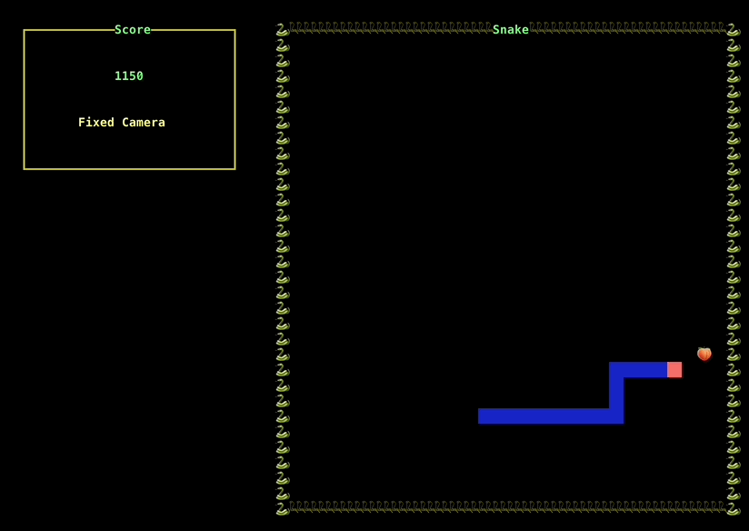
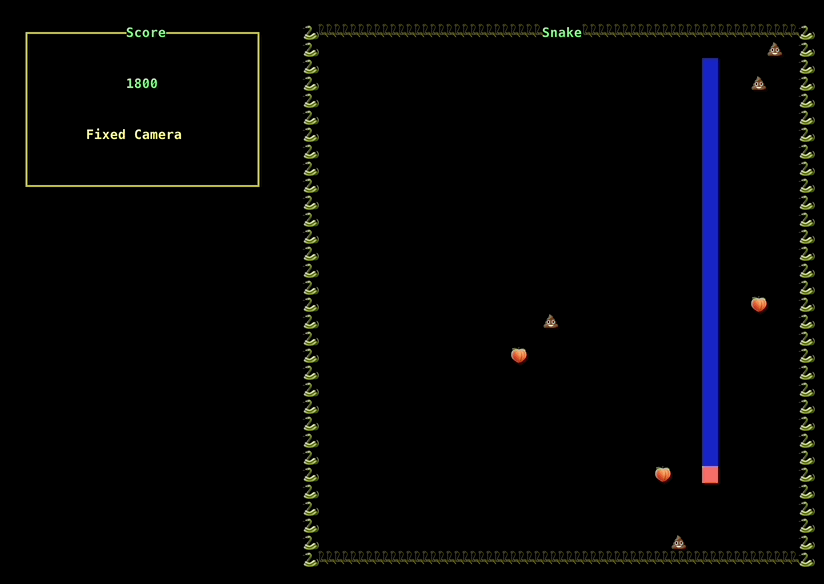
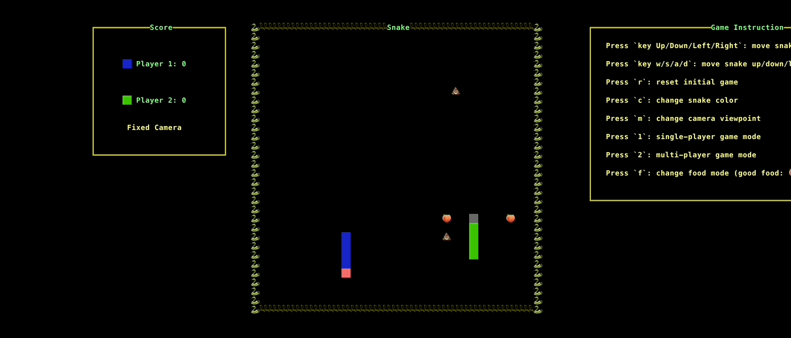

# Haskell Snake Game with Special Abilities and Puzzles

## How to play
   - Use `cabal run` to start the game in terminal.
   - Press key Up/Down/Left/Right` to move snake in single player mode. Press w/s/a/d to move second snake in the two player mode.
   - Press r: reset initial game  
   - Press c: change snake color
   - Press m: change camera viewpoint.
   - Press 1: single-player game mode; Press 2: multi-player game mode  
   - Press f: change food mode (good food: 🍑 , bad food: 💩 )   
   - Press `q`: quit game"
   - Press `,` / `.` to adjust the volume

## Features

### Multiple food types 🍑 💩; fixed, random, & multiple food modes 🍽️

### Fixed camera 📸; moving camera mode 📹; FPV camera mode 🎥

### Single 💁 & two 👫 player mode; with different cameras angles 😎

# Milestone1
## Project Overview

The goal of this project is to develop a special Snake game using Haskell with added features and challenges. The Snake game is a popular and timeless arcade game where the player controls a snake to eat apples and grow longer. In our version of the game, we aim to introduce special abilities triggered by consuming specific apples, the inclusion of puzzles or mazes to increase complexity and engagement, and other enhancements to make the game more exciting and challenging.

## Project Objectives

1. **Haskell Snake Game Implementation:** Develop a Snake game using Haskell that includes the core gameplay mechanics, such as snake movement, apple generation, and collision detection.

2. **Special Food:** Introduce special apples with different points. When the snake consumes these special apples, it will give different scores.
3. 
4. **User Interface:** Create an intuitive and visually appealing user interface for the game, including features like a scoreboard, game over screen, and user-friendly controls.

5. **Two player:** Use two player mode to play with friends. In this mode, the snake will not be killed by themselves when hit their body, but the snake will die when hit opponent's body. 

6. (optional) **Puzzles and Mazes:** Enhance the gameplay by incorporating puzzle elements or mazes within the game. These puzzles will add complexity and require strategic thinking from the player, making the game more challenging and engaging.
## Deliverables

1. **Snake Game:** A complete Snake game implemented in Haskell with the following features:
   - Snake movement and growth mechanics.
   - Apple generation and consumption.
   - Collision detection and game over conditions.
   - Mission and Scores Achievements.
   - Multiplayer/AI player mode where players can compete against each other or collaborate in achieving common goal.

2. **Special Abilities:** Special apples that grant unique abilities or trigger in-game events.

3. **User Interface:** An intuitive user interface that includes a start screen, game over screen, and a scoreboard.

4. **Documentation:** Detailed documentation explaining how to play the game and how special abilities and puzzles work.

5. **Testing:** Test cases and a report detailing testing procedures and results.

6. **Additonal features**: Should time allow, we plan to introduce more personalized features.
   - **Puzzles and Mazes:** Integrating puzzles or mazes into the game to increase complexity.
   -  Customized snakes options where players can customize their snacks with different colors, shapes.
   - Dynamic Environment such as moving platforms, changing landscapes, and day-night cycles.

# Milestone2
## What is the architecture of your application (the key components)?
The general architecture is planned as follow, we will modify the architecture through out the implementation upon needed:

1. **User Interface(UI.hs)**
   - **Main Components:**
     - `App`: Defines the main application structure, including drawing functions, event handling, and attribute mappings.
     - `main`: The entry point of the application. It sets up the event channel, initializes the game state, and starts the main application loop.
     - `handleEvent`: Handles user inputs and other events, like keyboard events for controlling the snake and the tick events that update the game state.
     - `drawUI`: Responsible for drawing the game on the screen, including the snake, food, score, and game over screen.

2. **Game Logic (Snake.hs):**
   - **Main Components:**
     - `Game`: Represents the game state, including the snake's position, direction, food location, score, and game status (like paused or dead).
     - `Snake`: A sequence of coordinates representing the snake's body.
     - `step`: Updates the game state based on the current state and direction of the snake.
     - `initGame`: Initializes the game with a random starting state.
     - Other subcompoment: Such as `move`, `die`, `eatFood`, `nextFood`..etc, which are helper functions to handle snake movement, eating food, dying, and generating new food.

3. **Integration between UI and Game Logic:**
   - The UI module imports the Snake module and uses its functions to manage the game state.
   - The `handleEvent` function in UI.hs calls functions from Snake.hs to update the game state in response to user inputs and ticks.
   - The `drawUI` function reads the game state from Snake.hs to render the game's current state on the screen.

Overall, the UI module handles user interaction and rendering, while the Snake module contains the core game logic and state management.

## What challenges (if any) did you have so far and how did you solve them?
### Outdated Libraries
   - **Issue**: We encountered some outdated libraries.
   - **Solution**: To address this, we are reworking specific functions and utilizing alternative, more up-to-date libraries.

### Tight Schedule
   - **Issue**: We are facing a tight schedule, as final exams, homework, and this final project are all occurring simultaneously.
   - **Solution**: To manage this, we are decoupling the components of our project. This allows us to work on different parts in parallel, maximizing our efficiency despite the time constraints.

## Do you expect to meet your goals until the deadline?
We are optimistic about meeting our goals by the deadline. Our planned achievements include:
   - Enhancing the user interface to make it more visually appealing.
   - Creating a variety of maps for diverse gameplay experiences.
   - Implementing a two-player mode for competitive play.
   - Introducing a special-effect apple to add an interesting twist to the game.

## If not, how will you modify your goals?
While we are confident in our ability to meet our objectives, we are prepared for unforeseen challenges. In the unlikely event that our progress is hindered:
- We will prioritize completing a basic version of the snake game.
- Try to simplify the functions of game, start from basic functions, add more interesting things if we have more time.

## Group Member
- Name: Yu Ming Chen, PID: A59010485, Github name: allenchen0958
- Name: Xuan Ding, PID: A16060562, Github name: dingxuan2000
- Name: Jiayan Dong, PID: A16593051, Github name: Jiayan-Dong
- Name: Keng-Chi Chang, PID: A53270228, Github name: KengChiChang
